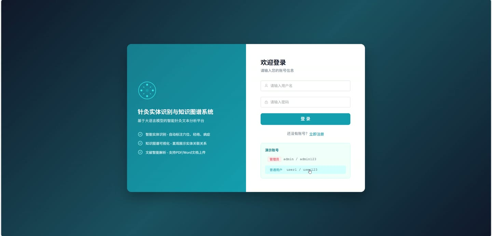
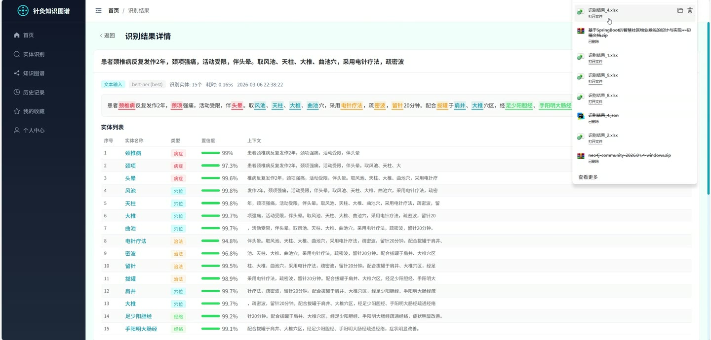
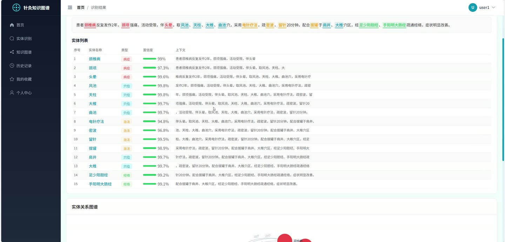
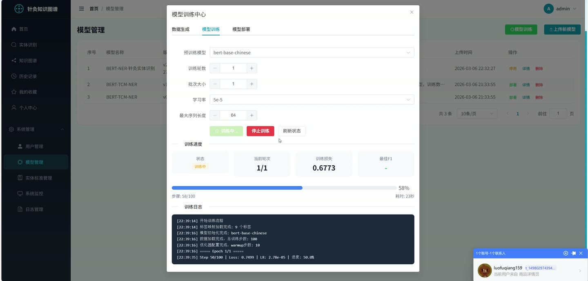
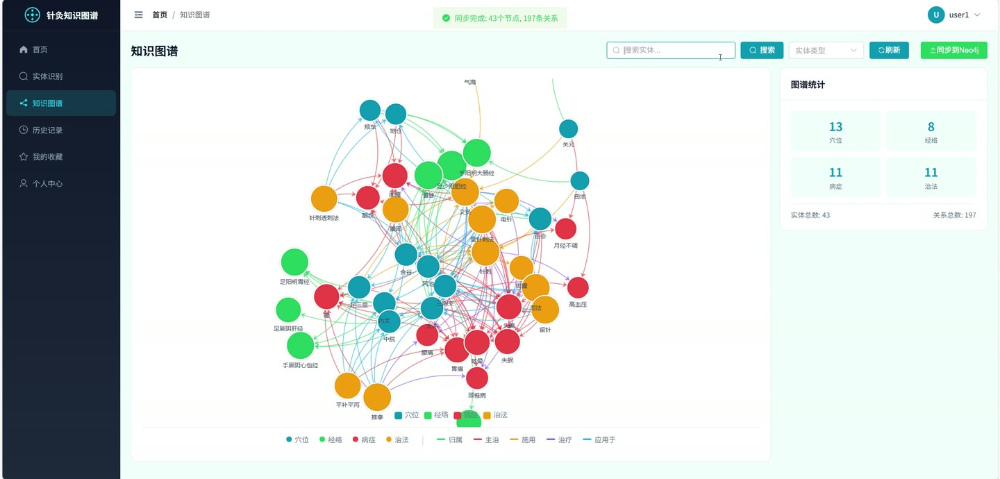
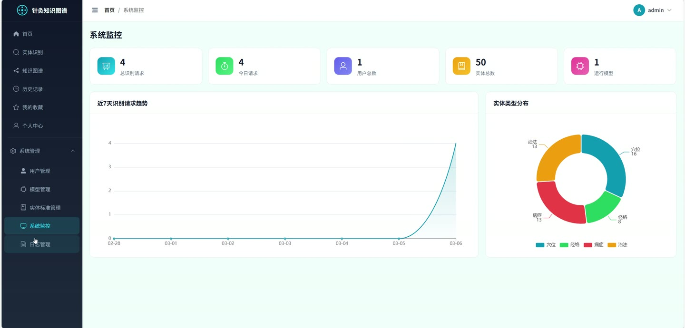

# (附文档)Python+深度学习+PyTorch 基于大语言模型的针灸实体识别与知识图谱系统

**技术栈**：Python、FastAPI、PyTorch、深度学习、Vue3、MySQL

### 系统简介

本系统是一套基于大语言模型与深度学习技术的针灸领域实体识别与知识图谱构建平台，采用前后端分离架构。后端基于 FastAPI 提供 RESTful 接口，通过 PyTorch 加载 BERT 序列标注模型完成针灸文本的实体抽取，并将识别结果同步至 MySQL 与 Neo4j 图数据库；前端使用 Vue3 + Element Plus 构建可视化管理界面。系统区分普通用户端与管理员端两类角色，覆盖文本识别、文件识别、图谱可视化、模型训练与部署、实体标准维护等完整业务链路。
 
### 核心功能
 
### 普通用户端

 
- 用户注册：校验用户名与手机号唯一性，写入加密密码并记录注册日志。 
- 用户登录：校验密码与账号状态，签发 JWT 令牌并返回用户角色信息。 
- 文本实体识别：提交针灸文本，返回穴位、经络、病症、治法四类实体及置信度、起止位置。 
- 文件实体识别：上传 PDF 或 Word 文档，自动提取正文文本后执行识别并保留原文。 
- 识别结果展示：按实体类型统计数量，展示实体上下文、置信度与处理耗时。 
- 关系抽取：基于识别出的实体自动推断归属、主治、施用、治疗、应用于等关系。 
- 识别记录管理：分页查看历史识别记录，支持查看详情与删除记录。 
- 结果导出：将单条识别记录导出为 Excel 表格或 JSON 结构化文件。 
- 知识图谱浏览：以力导向图展示实体节点与关系连线，支持按实体名搜索和按类型筛选。 
- 实体详情查看：点击图谱节点查看实体描述、国标编码、来源及关联关系列表。 
- 图谱统计：展示穴位、经络、病症、治法的实体数量与关系总数。 
- 收藏管理：对实体或识别记录添加收藏，支持按类型筛选、取消收藏与收藏状态检查。 
- 个人中心：修改手机号、邮箱、头像，上传头像文件，修改登录密码。
 
### 管理员端

 
- 用户管理：分页查询普通用户列表，按用户名或手机号搜索，修改用户状态与联系方式，删除用户。 
- 模型版本管理：分页查看模型列表，展示模型名称、版本、准确率、F1 值与训练参数。 
- 模型上传：上传 zip 模型包并自动解压，校验 config.json 与 label_map.json 完整性。 
- 模型自动评估：上传或部署时基于测试集自动计算准确率与 F1 分数并回写记录。 
- 模型状态切换：将模型设为运行中并加载至 NER 服务，或停用后回退至词典匹配。 
- 模型删除：删除非运行中的模型版本记录。 
- 实体标准管理：新增、修改、删除实体标准，维护标准名称、编码、类型、定义与参考出处。 
- 训练数据生成：基于词典与文献模板生成 BIO 标注的训练、验证、测试数据集。 
- 模型训练：配置模型名称、训练轮数、批大小、学习率、最大长度并异步启动训练任务。 
- 训练状态查询：轮询查看训练进度、日志历史与最佳 F1，完成后自动保存模型版本记录。 
- 训练任务停止：手动终止正在执行的训练任务。 
- 模型部署：选择已有模型记录或指定路径部署，自动切换 NER 服务为 BERT 推理。 
- 训练数据统计：查看标签数量、各数据集样本数与训练集实体分布。 
- 系统监控与日志管理：查看 API 请求日志、操作日志及系统运行状态。
 
### 技术栈

 后端框架Python + FastAPI + Uvicorn 深度学习PyTorch + Transformers（BERT 序列标注） ORMSQLAlchemy 权限认证JWT 令牌 + 角色鉴权依赖 数据库MySQL（业务数据）+ Neo4j（图数据） 前端框架Vue3 + Element Plus 可视化ECharts 力导向图 构建工具Vite 路由与状态Vue Router + Composition API 文件处理openpyxl、PDF/Word 文本提取
 
### 交付内容

 
- 后端完整源码 
- 前端完整源码 
- 数据库初始化脚本 
- 万字文档

## 界面展示

---

## 获取完整源码 + 万字文档

本仓库为项目介绍页。**完整前后端源码、数据库初始化脚本、万字项目文档**，请加微信 `kangkangcode`，或访问 [codekk.top](http://codekk.top) 获取。

可作课程设计 / 毕业设计参考，支持远程部署调试。